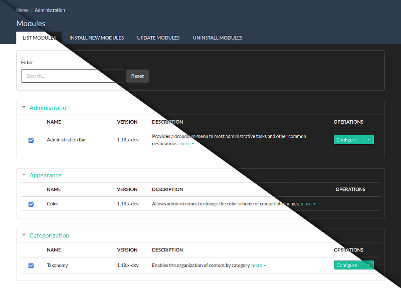

Lumi
====

Lumi (pronounced 'Loo-me') is a modern, customisable admin theme for Backdrop, now with dark mode!

Installation
------------

- Install and enable this theme using the official Backdrop CMS instructions at
  https://backdropcms.org/guide/themes.

- Visit the settings page under Administration > Appearance > Lumi Settings
  (admin/appearance/settings/lumi) to customise the theme.

Issues
------

Bugs and Feature requests should be reported in the Issue Queue:
https://github.com/backdrop-contrib/lumi/issues.

Current Maintainers
-------------------

- Seeking maintainer(s)

Credits
-------

- Created for Backdrop CMS by [Peter Anderson](https://github.com/BWPanda).
- Design and colours inspired by the 'Flatly' and 'Darkly'
  [Bootswatch](https://bootswatch.com/) themes.

License
-------

This project is GPL v2 software.
See the LICENSE.txt file in this directory for complete text.
